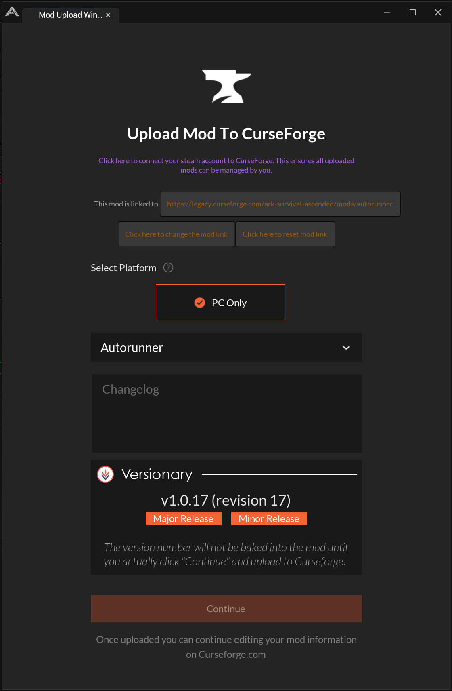

#  Versionary

## Overview

**Versionary** is a very simple *editor-only* mod for ARK Survival Ascended. All it does is provide a framework to make version management and mod distribution marginally less painful for the mod developers. It does two very simple things:

* It can "bake" build build and version data into a mod before uploading it to Curseforge, both the Curseforge "revision" number and a semantic version style version triplet (e.g. `v1.2.0` or such)
* It can obscure editor-only mods (like Versionary itself) from the upload dialog, keeping it less cluttered.

It does not override the actual Curseforge uploader (in the `UGC` editor menu); it instead adds a new `Versionary` menu on the end, with its own uploader option which loads a variant version of the Curseforge uploader widget. This is so that we don't modify the actual Curseforge `cfeditor` plugin and potentially need to revalidate the kit; it keeps Versionary nice and self-contained.

## Using Versionary

To use Versionary, you need to do a couple of things:

1. Clone this repository into a `Projects\ShooterGame\Mods\Versionary` directory within the ARKDevkit installation.
2. Ensure that you have set Versionary active in the `UGC` menu's `Enabled Mods` submenu.
3. Restart the ARK devkit. Upon restart, there will be a `Versionary` menu on the end of the Unreal editor's toolbar for the main (level editor) window.

Once this has been done, you can simply copy the `/Versionary/Templates/ModVersionData` file into the top level of your mod. Then you just pick the `Upload Versioned Mod` option from the Versionary menu instead of the `Share Mod` one from the UGC menu; Versionary will do the rest!

If you want to do a major or minor release, just click the buttons below the displayed version in the upload screen. If, for instance, the next version would normally be v1.0.17, clicking "Minor Release" would instead set it to 1.1.0, while clicking "Major Release" would set it to 2.0.0. In all cases, the version number will not be baked into the mod until you actually click "Continue" and upload the mod to Curseforge.

By default, Versionary should pick a version number in the form "1.0.*revision*" to start, where *revision* is the Curseforge revision that would be associated with that build. If you want to manually set a different initial version number, you can do so by changing the default values of the build variables (as listed below).

## How It Works

Versionary relies on a `ModVersionData` Blueprint in the top-level directory of any mod. The Blueprint can descend from any parent class type; it's the name and location which are important. By accessing the Blueprint using editor scripting, Versionary will read and change the default values of several variables (if present).

The variables which Versionary expects to control are:

* **Major** (Integer): the 'major' portion of a semantic version.
* **Minor** (Integer): the 'minor' portion of a semantic version.
* **Point** (Integer): the 'point' portion of a semantic version.
* **CF_Revision** (Integer): the Curseforge revision ID associated with this build.
* **BuildDate** (DateTime): a timestamp of when the mod was uploaded to Curseforge.

The variables which Versionary will *read* as per-mod settings are:

* **IncrementPointWithRevision** (Boolean): if `True`, Versionary will take whatever the difference is between the next revision as reported by Curseforge and the mod's currently-set `CF_Revision` value, and will automatically increment the `Point` value by that much when populating the uploader window.
* **ToolOnlyMod** (Boolean): if `True`, Versionary will ignore this mod when populating the mod list in the uploader window. Versionary itself has a top-level `ModVersionData` which has this set, ensuring it doesn't show up in its own upload menu.

There is an example `ModVersionData` in the `Templates` directory, which has all the variables (with descriptions!) as well as two helper functions to automatically format the build data as `Text` values for a mod to use wherever they wish to display their version number.

## Why Not Data Tables?

The goal with Versionary was to ensure that it added no additional dependencies to a mod. A data table requires a struct to back it; having just a generic Blueprint of any type with specific variables ensures that all a mod needs in order to use Versionary is that one file, with no other dependencies.

## Screenshot

Because every project needs a screenshot, right?

